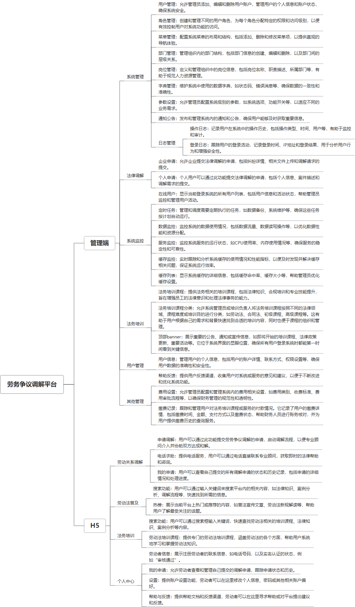

 

    
 

公司拥有上百套具有自主知识产权的软件系统，详情请查看码云首页或公司官网

 
<h1>劳务争议调节平台</h1>

<a href="https://www.haishi.net.cn/">公司官网</a> ｜ <a href="https://www.haishi.net.cn/">在线体验</a>

 

## 系统介绍

劳动争议调解、在线申请、提交资料、在线联系、接入GPT进行问答、劳动法普及、法务培训等功能
本项目名称为劳务争议调解平台，旨在为用户提供便捷、高效的劳务争议调解服务，帮助用户解决劳务纠纷，维护自身合法权益。
本项目从用户层面可以分为两个端：
- 管理端：平台管理员使用，可以进行用户管理、部门管理、角色管理、菜单管理、岗位管理、通知公告、日志管理、系统监控、法律调解、用户管理、法务培训、费用设置、缴费记录等。
- H5端：用户使用，可以进行劳务关系调解申请、电话求助、劳动法普及学习、法务培训课程学习、实名认证、查看我的申请、设置、帮助与反馈等。
                

## 系统功能介绍

### 系统包含终端说明

管理端（WEB）、用户端（H5）

| 序号 | 模块                   | 模块说明 |
| ---- | ---------------------- | -------- |
| 1    | FWY-ADJUST-CHAT-MANAGE | 管理端   |
| 2    | FWY-ADJUST-CHAT-H5     | H5端     |
| 3    | FWY-ADJUST-CHAT-SERVER | 服务端   |

### 系统功能结构

### 系统功能说明

- 法律调解：为用户提供在线法律咨询和调解服务，帮助用户解决劳务纠纷。
- 法务培训：为用户提供劳动法相关知识培训，提升用户的法律意识和自我保护能力。
- 劳务关系调解申请：用户可以通过平台提交劳务争议调解申请，平台将安排专业调解员进行调解。
- 电话求助：用户可以通过平台提供的电话热线进行咨询和求助，获得专业的法律指导。
- 劳动法普及：平台提供劳动法相关法律法规、案例分析等内容，帮助用户了解自身的权益和义务。

## 系统主要界面

## 系统技术说明

### 代码模块说明

| 序号 | 目录                                    | 目录说明 |
| ---- | --------------------------------------- | -------- |
| 1    | FWY-ADJUST-CHAT-SERVER/px-fwy-generator | --       |
| 2    | FWY-ADJUST-CHAT-SERVER/px-fwy-adjust    | --       |
| 3    | FWY-ADJUST-CHAT-SERVER/px-fwy-admin     | --       |
| 4    | FWY-ADJUST-CHAT-SERVER/px-fwy-framework | --       |
| 5    | FWY-ADJUST-CHAT-SERVER/px-fwy-quartz    | --       |
| 6    | FWY-ADJUST-CHAT-SERVER/px-fwy-common    | --       |
| 7    | FWY-ADJUST-CHAT-SERVER/px-fwy-system    | --       |

### 系统技术选型

#### 开发语言/框架

JAVA（JDK1.8）
前端框架：VUE2

#### 服务中间件

Nginx
Tomcat

#### 数据库

MySQL（5.7+）

#### 其他说明

无

## 系统演示/商用

请扫码添加客服微信获取演示地址和系统详细资料。

如果您想基于劳务争议调节平台进行商业化交付或定制开发服务，我们提供有偿的技术服务支持，合作模式不限，欢迎沟通！

公司官网地址： <a href="https://www.haishi.net.cn/">https://www.haishi.net.cn</a>

联系客服获取专业回答。

## 使用须知

1、 本项目商用必须获得版权所有者的授权。

2、 未经允许本项目代码不允许二次出售。

